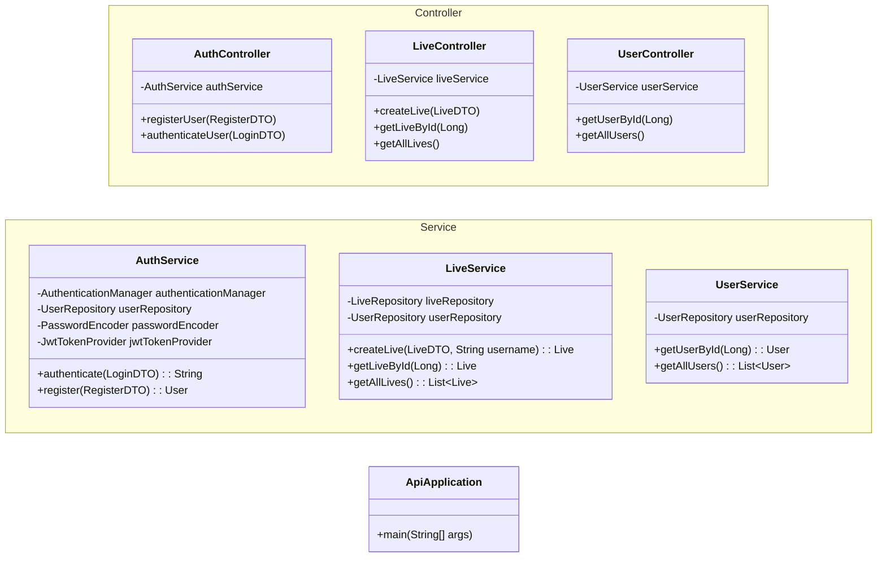

```mermaid
classDiagram
    direction LR

    class ApiApplication {
        +main(String[] args)
    }

    namespace Controller {
        class AuthController {
            -AuthService authService
            +registerUser(RegisterDTO)
            +authenticateUser(LoginDTO)
        }
        class LiveController {
            -LiveService liveService
            +createLive(LiveDTO)
            +getLiveById(Long)
            +getAllLives()
        }
        class UserController {
            -UserService userService
            +getUserById(Long)
            +getAllUsers()
        }
    }

    namespace Service {
        class AuthService {
            -AuthenticationManager authenticationManager
            -UserRepository userRepository
            -PasswordEncoder passwordEncoder
            -JwtTokenProvider jwtTokenProvider
            +authenticate(LoginDTO) : String
            +register(RegisterDTO) : User
        }
        class LiveService {
            -LiveRepository liveRepository
            -UserRepository userRepository
            +createLive(LiveDTO, String username) : Live
            +getLiveById(Long) : Live
            +getAllLives() : List~Live~
        }
        class UserService {
            -UserRepository userRepository
            +getUserById(Long) : User
            +getAllUsers() : List~User~
        }
    }


```
